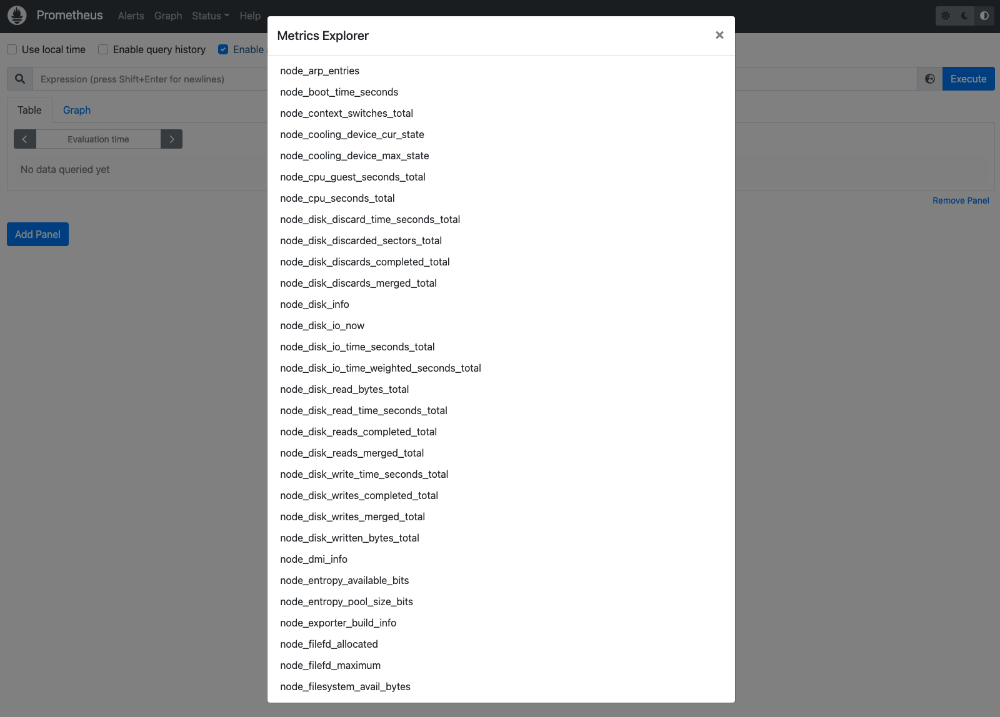

# Node Exporter

## Node Exporter  istallation and setting
To install prometheus we have to execute commannds indicated in `install_node_exporter.sh`.

## Collectors disabling
We will keep only following commonly used metrics:
- cpu
- diskstats
- filesystem
- loadavg
- meminfo
- netstat
- sockstat
- time

According to [documentation](https://github.com/prometheus/node_exporter/blob/master/README.md#collectors) to enable only some specific collector(s), we have to add `--collector.disable-defaults --collector.<name> ...` to `node_exporter.service`.

