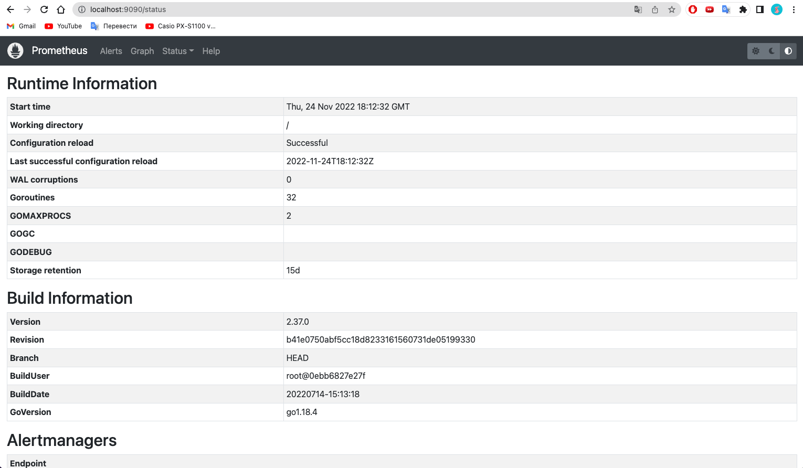
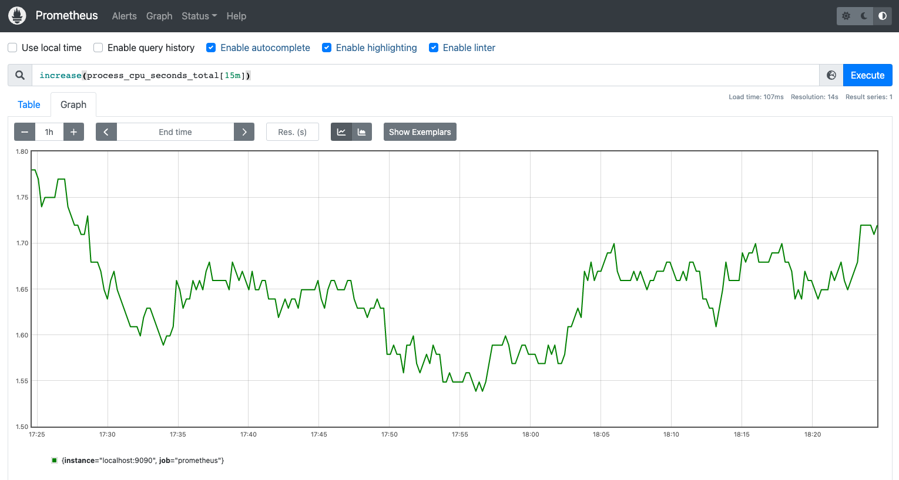
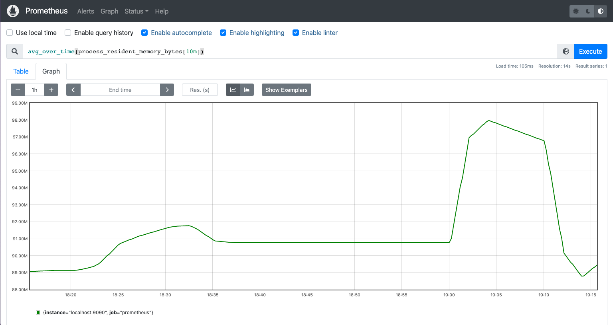

# Prometheus

## Promtheus istallation and setting
To install prometheus we have to execute commannds indicated in `install_prometheus.sh`.

## Promql usage demostration
1. Increase in total user and systemSPU time spent in second

2. Physical memory occupied by the Prometheus process averaged over the time

